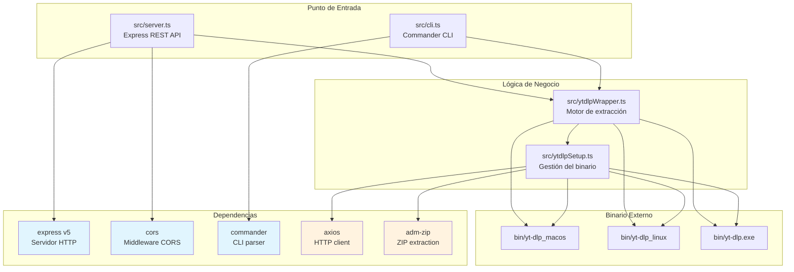
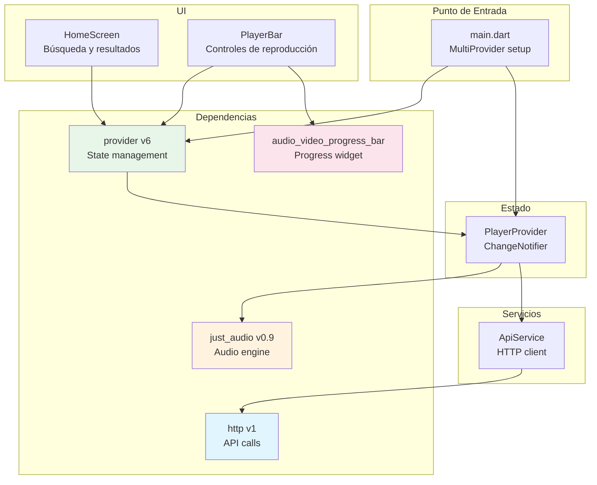
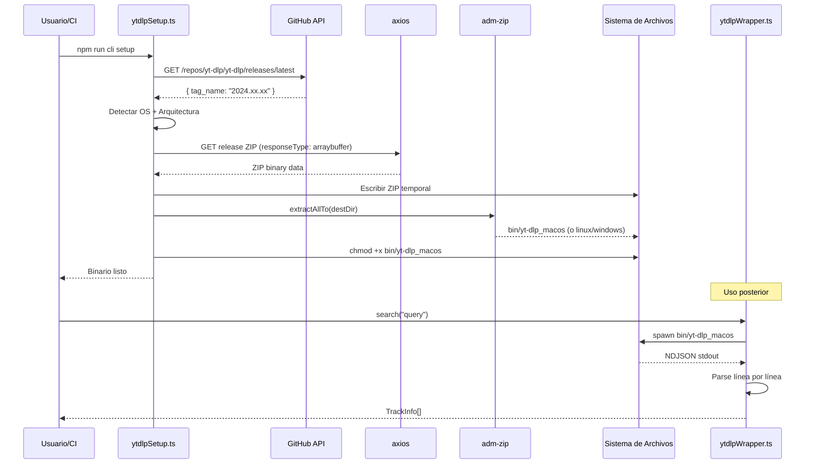
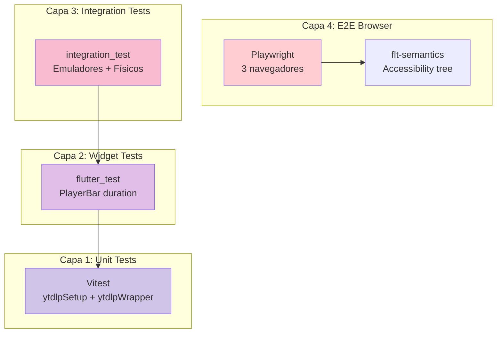
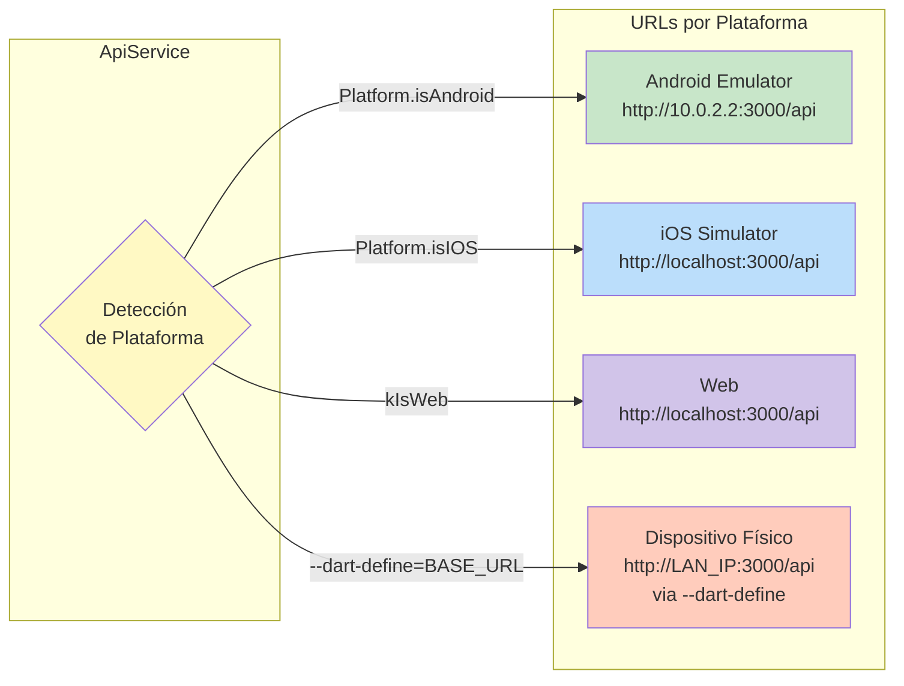
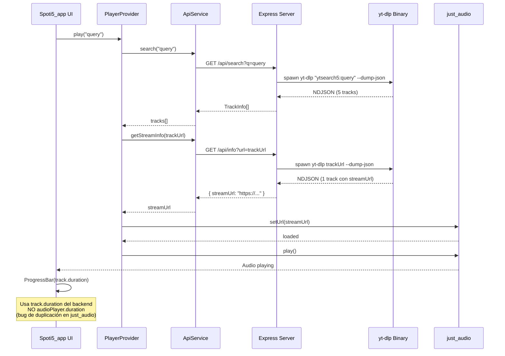

# Análisis Detallado de Dependencias y Librerías

Este documento proporciona un análisis exhaustivo de todas las dependencias utilizadas en el proyecto MusicProvider, incluyendo su propósito, patrón de integración, alternativas consideradas y justificación arquitectónica.

---

## 📋 Tabla de Contenidos

1. [Visión General del Proyecto](#1-visión-general-del-proyecto)
2. [Backend Node.js](#2-backend-nodejs)
3. [Frontend Flutter](#3-frontend-flutter)
4. [Herramientas de Desarrollo](#4-herramientas-de-desarrollo)
5. [Diagramas de Flujo de Dependencias](#5-diagramas-de-flujo-de-dependencias)
6. [Decisiones Arquitectónicas Clave](#6-decisiones-arquitectónicas-clave)
7. [Referencias y Documentación Relacionada](#7-referencias-y-documentación-relacionada)

---

## 1. Visión General del Proyecto

MusicProvider es un **Proof of Concept (PoC) dual-stack** para el reproductor de música [Nuclear](https://github.com/nuclearplayer/nuclear). Consiste en dos aplicaciones interconectadas:

- **Backend (Node.js + TypeScript)**: Servidor REST API y herramienta CLI que envuelve el binario `yt-dlp` para buscar, extraer metadatos y descargar streams de audio.
- **Frontend (Flutter/Dart)**: Aplicación multiplataforma (iOS, Android, macOS, Web) que consume la API del backend.

### Filosofía de Diseño de Dependencias

El proyecto mantiene un footprint de dependencias **intencionalmente minimalista**:

| Categoría | Cantidad |
|-----------|----------|
| Dependencias de producción (NPM) | 5 |
| Dependencias de desarrollo (NPM) | 8 |
| Dependencias directas (Dart) | 4 |

Esta restricción deliberada facilita la migración futura al ecosistema de plugins de Nuclear, donde las dependencias pesadas están desaconsejadas (ver [`.agents/skills/nuclear-reference/SKILL.md`](../.agents/skills/nuclear-reference/SKILL.md)).

---

## 2. Backend Node.js

### 2.1 Dependencias de Producción

#### `express` v5.2.1

**Propósito**: Framework HTTP para el servidor REST API.

**Patrón de integración**:
```typescript
// src/server.ts
const app = express();
app.use(cors());
app.use(express.static('Spoti5_app/build/web'));

app.get('/api/search', async (req, res) => { ... });
app.get('/api/info', async (req, res) => { ... });
app.get('/api/playlist', async (req, res) => { ... });
app.get('/api/download', async (req, res) => { ... });
```

**Por qué Express 5**:
- Simplicidad para una API con solo 4 endpoints
- Middleware `express.static()` integrado para servir la compilación web de Flutter
- Ecosistema maduro y documentación extensa

**Alternativas consideradas**:
- **Fastify**: Mejor rendimiento pero innecesario para una API simple
- **Hono**: Más moderno pero menos maduro en el ecosistema Node.js

**Riesgo identificado**: Express 5 era relativamente nuevo al momento del desarrollo. El ecosistema de middleware (como `cors`) puede retrasarse en compatibilidad con las APIs de Express 5.

---

#### `cors` v2.8.6

**Propósito**: Middleware para habilitar Cross-Origin Resource Sharing.

**Patrón de integración**:
```typescript
// src/server.ts
app.use(cors());
```

**Por qué es necesario**:
- La aplicación Flutter Web servida en `localhost:3000` debe hacer llamadas API al mismo origen
- Durante desarrollo y pruebas en dispositivos físicos, las peticiones cruzan diferentes orígenes (LAN IP vs localhost)

**Configuración**: Uso permisivo por defecto (`cors()`) sin restricciones de origen, apropiado para un entorno de desarrollo/PoC.

---

#### `commander` v12.1.0

**Propósito**: Parseo de argumentos para la interfaz de línea de comandos (CLI).

**Patrón de integración**:
```typescript
// src/cli.ts
import { Command } from 'commander';

const program = new Command();
program
  .name('music-provider')
  .description('CLI para interactuar con yt-dlp')
  .version('1.0.0');

program
  .command('setup')
  .description('Fuerza la descarga/actualización del binario yt-dlp')
  .action(setupCommand);

program
  .command('search <query>')
  .option('-l, --limit <number>', 'Número de resultados', '5')
  .action(searchCommand);
// ... más comandos
```

**Comandos disponibles**:
- `setup`: Descarga/actualiza el binario yt-dlp
- `search`: Búsqueda múltiple de tracks
- `stream`: Extracción de metadatos y URL de stream
- `playlist`: Extracción de playlists
- `download`: Descarga física de audio

**Por qué Commander**:
- API encadenable y limpia para definir subcomandos
- Soporte nativo para opciones, argumentos y texto de ayuda
- Ligero y adecuado para 5 comandos

**Alternativas consideradas**:
- **yargs**: Más completo pero excesivo para las necesidades del proyecto
- **meow**: Demasiado minimalista, sin soporte para subcomandos

---

#### `axios` v1.7.2

**Propósito**: Cliente HTTP para descargar el binario yt-dlp desde GitHub.

**Patrón de integración**:
```typescript
// src/ytdlpSetup.ts
import axios from 'axios';

async function downloadYtdlp(url: string, destPath: string): Promise<void> {
  const response = await axios.get(url, {
    responseType: 'arraybuffer',
    timeout: 300_000, // 5 minutos para archivos grandes
  });
  
  fs.writeFileSync(destPath, Buffer.from(response.data));
}
```

**Casos de uso específicos**:
1. Descarga del ZIP de yt-dlp desde GitHub Releases (`responseType: 'arraybuffer'`)
2. Consulta a la GitHub API para obtener el tag del último release

**Por qué axios**:
- API limpia para descargas binarias con `responseType: 'arraybuffer'`
- Soporte integrado para timeouts (5 minutos para ZIPs grandes)
- Manejo transparente de redirects (necesario para URLs de GitHub Releases)

**Alternativas consideradas**:
- **node:https (built-in)**: Podría evitar esta dependencia, pero la API es menos ergonómica para arraybuffers y timeouts
- **node-fetch**: Similar a axios pero con menos características integradas

---

#### `adm-zip` v0.5.14

**Propósito**: Extracción del binario yt-dlp desde el archivo ZIP descargado.

**Patrón de integración**:
```typescript
// src/ytdlpSetup.ts
import AdmZip from 'adm-zip';

async function extractBinary(zipPath: string, destDir: string): Promise<void> {
  const zip = new AdmZip(zipPath);
  zip.extractAllTo(destDir, true);
}
```

**Por qué adm-zip**:
- API síncrona de extracción en una sola llamada (`extractAllTo`)
- Ideal para extraer un archivo ZIP que contiene un único binario
- Simplicidad de uso sin necesidad de streams o eventos

**Alternativas consideradas**:
- **yauzl**: Más eficiente en memoria para archivos grandes pero requiere extracción basada en streams/eventos
- **unzipper**: Similar a yauzl, excesivo para un archivo ZIP de un solo elemento

---

### 2.2 Mapa de Integración del Backend



---

## 3. Frontend Flutter

### 3.1 Dependencias Directas

#### `http` v1.2.0

**Propósito**: Cliente HTTP para realizar peticiones GET a la API del backend.

**Patrón de integración**:
```dart
// lib/services/api_service.dart
import 'package:http/http.dart' as http;

class ApiService {
  static String get baseUrl {
    if (kIsWeb) return 'http://localhost:3000/api';
    if (Platform.isAndroid) return 'http://10.0.2.2:3000/api';
    if (Platform.isIOS) return 'http://localhost:3000/api';
    return 'http://localhost:3000/api';
  }

  static Future<List<Track>> search(String query) async {
    final response = await http.get(Uri.parse('$baseUrl/search?q=$query'));
    // Parse JSON response...
  }
}
```

**Por qué el paquete `http`**:
- Cliente HTTP oficial del equipo de Dart
- Suficiente para peticiones GET simples con parseo JSON
- Sin necesidad de interceptores, reintentos o características avanzadas

**Alternativas consideradas**:
- **dio**: Más completo con interceptores y reintentos, innecesario para este caso de uso
- **http_client**: Alternativa menos estándar

---

#### `just_audio` v0.9.36

**Propósito**: Motor de reproducción de audio multiplataforma.

**Patrón de integración**:
```dart
// lib/providers/player_provider.dart
import 'package:just_audio/just_audio.dart';

class PlayerProvider extends ChangeNotifier {
  final AudioPlayer _audioPlayer = AudioPlayer();
  
  Future<void> play(String streamUrl) async {
    await _audioPlayer.setUrl(streamUrl);
    _audioPlayer.play();
  }
}
```

**Características clave utilizadas**:
- `setUrl()`: Carga asíncrona de URLs de stream temporales de yt-dlp
- Soporte para HLS, DASH y streams directos
- Compatibilidad con iOS, Android, Web, macOS, Windows, Linux

**Bug conocido documentado**:
`just_audio` tiene un bug que **duplica la duración reportada** por `audioPlayer.duration`. El código utiliza explícitamente `track.duration` (del backend) como fuente de verdad en lugar de depender de `just_audio` (ver [`player_bar.dart`](../Spoti5_app/lib/widgets/player_bar.dart) y el test [`player_bar_duration_test.dart`](../Spoti5_app/test/player_bar_duration_test.dart)).

**Por qué just_audio**:
- Soporte nativo para streaming directo de URLs (crítico para URLs temporales de yt-dlp)
- Funciona en las 6 plataformas Flutter sin configuración adicional
- API simple con `setUrl()` para carga asíncrona

**Alternativas consideradas**:
- **audioplayers**: Menos soporte para streams directos
- **assets_audio_player**: Enfocado en assets locales, no streams remotos

---

#### `audio_video_progress_bar` v2.0.3

**Propósito**: Widget de barra de progreso seekable para la reproducción.

**Patrón de integración**:
```dart
// lib/widgets/player_bar.dart
import 'package:audio_video_progress_bar/audio_video_progress_bar.dart';

ProgressBar(
  progress: position,
  total: duration,
  onSeek: (duration) {
    context.read<PlayerProvider>().seek(duration);
  },
)
```

**Por qué este widget**:
- API simple con tres parámetros: `progress`, `total`, `onSeek`
- Diseño Material Design consistente con la UI de la aplicación
- Seek nativo sin necesidad de implementación manual

---

#### `provider` v6.1.2

**Propósito**: Manejo de estado mediante el patrón Provider.

**Patrón de integración**:
```dart
// lib/main.dart
MultiProvider(
  providers: [
    ChangeNotifierProvider(create: (_) => PlayerProvider()),
  ],
  child: MaterialApp(...)
)

// lib/widgets/player_bar.dart
context.watch<PlayerProvider>()  // Reconstruye en cambios
context.read<PlayerProvider>()   // Acceso imperativo (sin rebuild)
```

**Por qué Provider**:
- Solución de manejo de estado **oficialmente recomendada** por el equipo de Flutter
- Para un único `PlayerProvider` con `ChangeNotifier`, es la aproximación más simple y estándar
- Suficiente para las necesidades actuales del proyecto

**Alternativas consideradas**:
- **Riverpod**: Más moderno y testable, pero excesivo para un solo provider
- **BLoC**: Más complejo con streams, innecesario para este caso
- **GetX**: Demasiado opinado y con acoplamiento fuerte

---

### 3.2 Mapa de Integración del Frontend



---

## 4. Herramientas de Desarrollo

### 4.1 Backend (Node.js Dev Dependencies)

#### `typescript` v5.5.2

**Propósito**: Compilador de TypeScript.

**Configuración** (`tsconfig.json`):
```json
{
  "compilerOptions": {
    "target": "es2022",
    "module": "nodenext",
    "moduleResolution": "nodenext",
    "esModuleInterop": true,
    "strict": true,
    "outDir": "./dist",
    "rootDir": "./src"
  }
}
```

**Decisiones clave**:
- **`es2022`**: Características modernas del runtime (top-level await, etc.)
- **`nodenext`**: Resolución de módulos nativa ESM de Node.js
- **`esModuleInterop: true`**: Permite `import express from 'express'` para paquetes CommonJS
- **`strict: true`**: Seguridad de tipos completa

---

#### `tsx` v4.16.2

**Propósito**: Ejecución directa de TypeScript sin pre-compilación.

**Uso**:
```bash
npm run dev:server  # Ejecuta: tsx src/server.ts
```

**Por qué tsx**:
- Usa esbuild para ejecución instantánea de TypeScript
- Cero configuración necesaria
- Soporte nativo para ESM sin los problemas de configuración de `ts-node`

**Alternativas consideradas**:
- **ts-node**: Requiere flags experimentales para ESM y configuración compleja
- **tsm**: Menos mantenido y con menos características

---

#### `vitest` v1.6.0

**Propósito**: Framework de pruebas unitarias e integración.

**Configuración** (`vitest.config.ts`):
```typescript
import { defineConfig } from 'vitest/config';

export default defineConfig({
  test: {
    exclude: ['tests/e2e/**', 'node_modules/**'],
  },
});
```

**Por qué Vitest**:
- **Soporte ESM nativo**: Crítico porque el proyecto usa `"type": "module"` en `package.json`
- **Velocidad**: Usa el pipeline de transformación de Vite
- **Compatibilidad**: API similar a Jest con `describe`, `it`, `expect`

**Alternativas consideradas**:
- **Jest**: Tiene fricción conocida con ESM (flags experimentales, configuración de transformación)

**Archivos de prueba**:
- `tests/ytdlpSetup.test.ts`: Prueba detección de plataforma (sin red)
- `tests/ytdlpWrapper.test.ts`: Prueba búsqueda/stream/descarga (yt-dlp real + YouTube real)

---

#### `@playwright/test` v1.61.1

**Propósito**: Tests E2E multi-navegador para la aplicación Flutter Web.

**Configuración** (`playwright.config.ts`):
```typescript
export default defineConfig({
  testDir: './tests/e2e',
  projects: [
    { name: 'chromium', use: { ...devices['Desktop Chrome'] } },
    { name: 'firefox', use: { ...devices['Desktop Firefox'] } },
    { name: 'webkit', use: { ...devices['Desktop Safari'] } },
  ],
  webServer: {
    command: 'npm run dev:server',
    url: 'http://localhost:3000',
    reuseExistingServer: !process.env.CI,
    timeout: 60_000,
  },
});
```

**Características utilizadas**:
- **Multi-navegador**: Tests en Chromium, Firefox y WebKit
- **`webServer`**: Levanta automáticamente el servidor Express antes de los tests
- **CI-aware**: `retries: 2`, `workers: 1` en CI; `retries: 0` localmente
- **Artefactos**: Screenshots en fallo, video retenido en fallo, reporter HTML

**Desafío documentado**:
Flutter Web (CanvasKit) renderiza en `<canvas>`, rompiendo los selectores DOM tradicionales. Los tests E2E usan nodos de accesibilidad `flt-semantics` con atributos `aria-label` y el estado `attached` (no `visible`) como workaround documentado (ver [`docs/testing/e2e_web_playwright.md`](./testing/e2e_web_playwright.md)).

---

#### Paquetes de Tipos TypeScript

| Paquete | Versión | Propósito |
|---------|---------|-----------|
| `@types/node` | ^20.14.9 | Tipos para módulos built-in (`os`, `path`, `fs`, `child_process`, `url`) |
| `@types/express` | ^5.0.6 | Tipos para la API de Express 5 (routes, Request, Response) |
| `@types/cors` | ^2.8.19 | Tipos para las opciones del middleware CORS |
| `@types/adm-zip` | ^0.5.8 | Tipos para la API `extractAllTo` de AdmZip |

---

### 4.2 Frontend (Flutter Dev Dependencies)

#### `flutter_test` (SDK)

**Propósito**: Pruebas de widgets Flutter.

**Ejemplo de uso** (`test/player_bar_duration_test.dart`):
```dart
testWidgets('PlayerBar uses track.duration instead of audioPlayer.duration',
    (WidgetTester tester) async {
  // Verifica que la UI use track.duration (del backend)
  // en lugar de audioPlayer.duration (que just_audio duplica)
});
```

---

#### `integration_test` (SDK)

**Propósito**: Pruebas de integración en dispositivos reales y emuladores.

**Uso**: Ejecuta `integration_test/app_test.dart` para validar el flujo completo de la aplicación.

**Documentación**: Ver [`docs/testing/e2e_mobile_emuladores.md`](./testing/e2e_mobile_emuladores.md) y [`docs/testing/e2e_mobile_fisicos.md`](./testing/e2e_mobile_fisicos.md).

---

#### `flutter_lints` v3.0.0

**Propósito**: Reglas de análisis estático estandarizadas.

**Configuración** (`analysis_options.yaml`):
```yaml
include: package:flutter_lints/flutter.yaml
```

---

## 5. Diagramas de Flujo de Dependencias

### 5.1 Ciclo de Vida del Binario yt-dlp



---

### 5.2 Pirámide de Testing



---

### 5.3 Abstracción de Plataformas (Flutter)



---

### 5.4 Flujo Completo de Reproducción



---

## 6. Decisiones Arquitectónicas Clave

### 6.1 ESM Nativo

**Decisión**: Usar `"type": "module"` en `package.json` con `tsconfig.json` configurado para `nodenext`.

**Implicaciones**:
- Todas las importaciones relativas deben usar extensión `.js` (ej: `import { search } from './ytdlpWrapper.js'`)
- Necesidad de `esModuleInterop: true` para importar paquetes CommonJS
- Alineación con el estándar web y facilita la migración a Nuclear

**Documentación**: Ver [`.agents/AGENTS.md`](../.agents/AGENTS.md) para las reglas estrictas de ESM.

---

### 6.2 Gestión Autónoma del Binario

**Decisión**: Descargar automáticamente yt-dlp desde GitHub en lugar de depender de instalación global o wrappers de NPM.

**Razones**:
1. **Frescura**: Siempre usa la última versión nightly con fixes recientes de YouTube
2. **Consistencia**: Elimina diferencias entre entornos de desarrollo y CI
3. **Control**: Evita dependencia en wrappers de terceros que pueden desactualizarse

**Implementación**: Ver [`src/ytdlpSetup.ts`](../src/ytdlpSetup.ts).

**Documentación**: Ver [`docs/contexto_y_estado.md`](./contexto_y_estado.md) sección 2.

---

### 6.3 Parseo NDJSON

**Decisión**: Procesar la salida de yt-dlp línea por línea en lugar de intentar parsear JSON completo.

**Razones**:
1. **Memoria**: Playlists gigantes pueden causar OOM si se acumulan en buffer
2. **Robustez**: NDJSON permite recuperarse de líneas malformadas sin perder todo el batch
3. **Streaming**: Permite procesar resultados conforme llegan

**Implementación**: Recolector de buffers en `stdout.on('data')` que separa por `\n`.

**Documentación**: Ver [`.agents/skills/music-provider/SKILL.md`](../.agents/skills/music-provider/SKILL.md).

---

### 6.4 Motor de Búsqueda Anti-Bot

**Decisión**: Usar `ytsearchN:query` en lugar de URLs directas de playlists.

**Razones**:
1. **Robustez**: Las URLs directas de playlists fallan frecuentemente por bloqueos antibot
2. **Consistencia**: `ytsearchN:` usa el motor de búsqueda integrado de yt-dlp
3. **Flexibilidad**: Permite controlar el número de resultados con el parámetro N

**Documentación**: Ver [`docs/contexto_y_estado.md`](./contexto_y_estado.md) sección 2.

---

### 6.5 Workaround para just_audio

**Decisión**: Usar `track.duration` del backend en lugar de `audioPlayer.duration` de just_audio.

**Razones**:
1. **Bug conocido**: just_audio reporta duración duplicada en algunos casos
2. **Fuente de verdad**: yt-dlp proporciona duración precisa desde los metadatos
3. **Defensivo**: Evita acoplarse al comportamiento interno de just_audio

**Implementación**: Ver [`lib/widgets/player_bar.dart`](../Spoti5_app/lib/widgets/player_bar.dart) y [`test/player_bar_duration_test.dart`](../Spoti5_app/test/player_bar_duration_test.dart).

**Documentación**: Ver [`docs/setup_y_arquitectura.md`](./setup_y_arquitectura.md) y [`docs/testing/`](./testing/).

---

## 7. Referencias y Documentación Relacionada

### Documentación Principal

| Documento | Contenido |
|-----------|-----------|
| [`README.md`](../README.md) | Visión general del proyecto, propósito y estado actual |
| [`docs/setup_y_arquitectura.md`](./setup_y_arquitectura.md) | Arquitectura Cliente-Servidor y guía de configuración de Flutter |
| [`docs/contexto_y_estado.md`](./contexto_y_estado.md) | Contexto original y decisiones arquitectónicas detalladas |
| [`docs/architecture_mapping.md`](./architecture_mapping.md) | Mapeo de responsabilidades hacia el ecosistema Nuclear |
| [`docs/integration_guide.md`](./integration_guide.md) | Checklist para integración como plugin de Nuclear |

### Documentación de Testing

| Documento | Contenido |
|-----------|-----------|
| [`docs/testing/README.md`](./testing/README.md) | Índice de todas las estrategias de testing |
| [`docs/testing/e2e_web_playwright.md`](./testing/e2e_web_playwright.md) | E2E Web con Playwright y workaround de CanvasKit |
| [`docs/testing/e2e_mobile_emuladores.md`](./testing/e2e_mobile_emuladores.md) | E2E en emuladores Android/iOS |
| [`docs/testing/e2e_mobile_fisicos.md`](./testing/e2e_mobile_fisicos.md) | E2E en dispositivos físicos |
| [`docs/testing/ios_troubleshooting.md`](./testing/ios_troubleshooting.md) | Solución a problemas comunes en iOS |

### Skills de Agentes

| Skill | Contenido |
|-------|-----------|
| [`.agents/AGENTS.md`](../.agents/AGENTS.md) | Reglas estrictas de desarrollo (ESM, TypeScript, Vitest) |
| [`.agents/skills/music-provider/SKILL.md`](../.agents/skills/music-provider/SKILL.md) | Know-how técnico del wrapper yt-dlp |
| [`.agents/skills/nuclear-reference/SKILL.md`](../.agents/skills/nuclear-reference/SKILL.md) | Alineación con el ecosistema Nuclear |

### Archivos de Configuración

| Archivo | Contenido |
|---------|-----------|
| [`package.json`](../package.json) | Dependencias NPM y scripts |
| [`Spoti5_app/pubspec.yaml`](../Spoti5_app/pubspec.yaml) | Dependencias Dart/Flutter |
| [`tsconfig.json`](../tsconfig.json) | Configuración del compilador TypeScript |
| [`vitest.config.ts`](../vitest.config.ts) | Configuración de Vitest (excluye E2E) |
| [`playwright.config.ts`](../playwright.config.ts) | Configuración de Playwright (multi-navegador) |

---

## 8. Riesgos y Consideraciones Futuras

### 8.1 Riesgos Identificados

1. **Express 5**: Ecosistema de middleware puede retrasarse en compatibilidad
2. **just_audio duration bug**: Ya mitigado con workaround defensivo
3. **Gestión de binario yt-dlp**: Dependencia en la estructura de GitHub Releases
4. **Medidas antibot de YouTube**: Fragilidad documentada en README

### 8.2 Preparación para Nuclear

La migración a Nuclear requerirá (ver [`docs/integration_guide.md`](./integration_guide.md)):
- Reemplazar `child_process.spawn` con comandos IPC de Tauri
- Reemplazar operaciones `fs` con APIs nativas de Tauri
- Mapear interfaces internas a tipos del `@nuclearplayer/plugin-sdk`
- El conjunto actual de dependencias es intencionalmente minimalista para facilitar esta migración

---

## 9. Estadísticas de Dependencias

### Backend (Node.js)

| Categoría | Cantidad |
|-----------|----------|
| Producción | 5 |
| Desarrollo | 8 |
| Total NPM | 13 |

### Frontend (Flutter)

| Categoría | Cantidad |
|-----------|----------|
| Directas | 4 |
| Dev | 3 |
| Total Dart | 7 |

### Dependencias Externas (No NPM/Dart)

| Dependencia | Gestión | Propósito |
|-------------|---------|-----------|
| yt-dlp | Auto-descarga desde GitHub | Motor de extracción de medios |
| Flutter SDK | Instalación manual | CLI, Dart SDK, toolchains |
| Xcode | App Store | Builds iOS/macOS |
| Android SDK | Android Studio | Builds Android + emulador |
| CocoaPods | `cd ios && pod install` | Dependencias nativas iOS |
| Rosetta 2 | `softwareupdate` | Binario x64 en Apple Silicon |

---

*Documento generado como referencia técnica permanente del proyecto MusicProvider.*
*Última actualización: 2026-07-21*